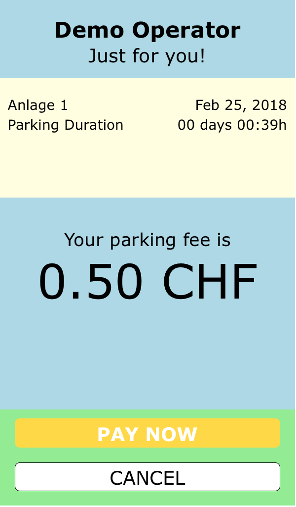

# Scheidt & Bachmann entervoCheckoutPlugin (3rd Party PSP)


## Sample Projects
This documentation provides a complete step-by-step tuturial on how to create your first application with the <i>entervoCheckoutPlugin</i> embedded. If you can't wait to kickstart however, you can also download one a (simple) sample project right here and get started this way.


* view the <a href="https://github.com/Scheidt-BachmannDeveloperSK/entervoCheckoutPlugin-iOS-3rdParty/tree/v1.0.60/examples/CheckoutDemo3rdParty">Sample Project using a 3rd Party PSP (handled by you)</a>  

...or clone the repository via

```bash
git clone https://github.com/Scheidt-BachmannDeveloperSK/entervoCheckoutPlugin-iOS-3rdParty.git
```

, open the workspace (not the project) and hit run!

<hr>
## Development Environment Pre-Requisites

### Supported XCode Versions, Swift Language Level, SDK Level

Up until version <i>1.0.58</i>, the plugin supported the use Apple <b>XCode version 9.x</b> and Swift with a language level of <b>3.2</b>. Wit version <i>1.0.60</i>, this has been upgraded to <b>XCode version 10.x</b> and Swift language level <b>4.2</b>, SDK version <b>12.x</b>. By default, the CocoaPods dependency manager (see next paragraph) will pull the most recent version of the plugin. If for some reason you still need to remain in an XCode 9 environment, you will have to specifically pull version <i>1.0.58</i> fo the plugin.

### CocoaPods
The <i>entervoCheckoutPlugin</i> plugin is provided as a pod, i.e. we're using the popular dependency manager <i>CocoaPods</i> to provide developers with the plugin (both, initially and in case of future updates). If you're not familiar with <i>CocoaPods</i> and would like to learn more, you can visit their website <a href="https://cocoapods.org">here</a>. If however you'd just like to get started with the <i>entervoCheckoutPlugin</i> plugin, follow the step-by-step instructions in the next section.

## Getting started
### Install CocoaPods
If you haven't already done so, you will first have to install <i>CocoaPods</i>. Open a terminal window, and run the following commands:

```bash
# sudo gem install cocoapods  
# pod setup  
```

This will install the latest stable version of <i>CocoaPods</i> on your Mac and update the list of podspec sources.

### Create 1st Demo Project
In a next step, launch <i>XCode</i> and create a new project, e.g. a single view application. Close <i>XCode</i> and in your terminal window, navigate to the newly created project directory. Execute the following command:

```bash
# pod init
```

This will create a file named 'Podfile' in your project directory. The <i>Podfile</i> is the location where you can add and manage the dependencies of your <i>XCode</i> project. Open the file with your favorite editor. It will look similar to this snippet:

```bash
# Uncomment the next line to define a global platform for your project
# platform :ios, '9.0'

target 'MyAwsomeDemoApp' do
  # Comment the next line if you're not using Swift and don't want to use dynamic frameworks
  use_frameworks!

  # Pods for MyAwsomeDemoApp

end
```

As you can see, no dependencies (pods) have been added yet. You will have to do this in a next step.

Each pod has a unique name. The plugin's official name is <i>entervoCheckoutPlugin</i>. Open the <i>Podfile</i> again, and add the <i>entervoCheckoutPlugin</i> dependency:

```bash
# Uncomment the next line to define a global platform for your project
# platform :ios, '9.0'

target 'MyAwsomeDemoApp' do
  # Comment the next line if you're not using Swift and  
  # don't want to use dynamic frameworks
  use_frameworks!

  # Pods for MyAwsomeDemoApp
  pod 'entervoCheckoutPlugin'

end
```

For now, your <i>Podfile</i> is complete. In the terminal window, execute this command:

```bash
# pod install
```

This will pull the <i>entervoCheckoutPlugin</i> plugin binaries from the official repository and install it in your project. Along those lines, <i>CocoaPods</i> will generate an <i>XCode</i> <b>workspace</b> from your project.

<div class="important">
<b>Important Note</b>: from now on, you will <b>always</b> have to use the <b>workspace</b> file, not the <b>project</b> file. Please note that this is a generic requirement for using <i>CocoaPods></i>, it is in no way <i>entervoCheckoutPlugin</i> plugin related.


Now, your first application is ready to use the <i>entervoCheckoutPlugin</i> plugin. If you leave out the mini <i>CocoaPods</i> tutorial in here, all you had to do for this, was adding the one line <span class="background-color highlight-dark-color">pod 'entervoCheckoutPlugin'</span>. So, go ahead and open the newly created workspace file for your project. You will notice that your workspace now contains the <i>entervoCheckoutPlugin</i> pod (which is the actual plugin).


The demo app that comes with the plugin (see <a>here</a>) is an excellent starting point to explore how the plugin works and how you can customize it to blend in with the design of your own mobile application. In the following section, we will take a closer look at selected parts of a typical application using the plugin.

Note: if you need an older version of the plugin, you can specify this in the Podfile like this:

```bash
pod 'entervoCheckoutPlugin','1.0.58'
```

This will pull the last XCode 9/Swift 3.2 compatible version of the plugin instead of the most recent version.

# API Users Guide
## Plugin Initialization
Before you can use the plugin, you will have to create an instance of it. The plugin's constructor expects you to pass in the api key that was provided to you by Scheidt & Bachmann. A second parameter, <i>environment</i>, will indicate the target environment to use: <b>PRELIVE</b> for pre-go-live testing purposes or <b>LIVE</b> for the production environment. So, instantiating the plugin will look something like this:

```swift
import entervoCheckoutPlugin

let plugin = SBCheckOut( apikey: "THE-API-KEY-PROVIDED-TO-YOU", environment: .PRELIVE)
```

By default, the <i>entervoCheckoutPlugin</i> plugin comes with built-in support for <i>Braintree</i> as the PSP (payment service provider). As a result, you will be able to offer payment via both, <i>PayPal</i> and credit cards. As an alternative, you can use a different payment engine (to be implemented and provided by you). Please see the separate section 'Payment Services' for further details.
## Preparing Plugin Use
The plugin is just a guest inside your application. We have done everything to make this as unintrusive as possible. Obviously, there needs to be a mechanism via which the <i>entervoCheckoutPlugin</i> pluging and your application can communicate. For the <i>iOS</i> operating system, this has been defined in form of a protocol. You will typically base the <i>entervoCheckoutPlugin</i> plugin off of a viewcontroller of your own. This viewcontroller will have to conform to the plugin's protocol, the <i>SBCheckOutDelegate</i> protocol. So, your viewcontroller will look like this:

```swift
import UIKit
import entervoCheckoutPlugin

class MyAwsomeViewController: UIViewController, SBCheckOutDelegate {

    // ... your source code

}
```

The <i>SBCheckOutDelegate</i> protocol requires you to implement three methods via which communication between your application and the plugin is handled:

```swift
// delegate functions to conform to the SBCheckOutDelegate protocol
func onError( message: String) -> Void
func onMessage( level: SBCheckOut.LogLevel, message: String) -> Void
func onStatus( newStatus: SBCheckOut.Status, info: Any?) -> Void
```

The use of the three methods is basically self-explanatory, but we'll quickly go over them.

### <b>onError( message: String)</b>
This function is used as a call-back to let your application know that something didn't work. Under normal conditions, the plugin is trying to handle all upcoming issues itself and not bother the hosting application. There are however a few situations where the plugin will have to let you known that an action failed. The most popular examples for this are

* the hosting application (i.e. your app) is trying to start a checkout flow without a proper prior initialization of the plugin
* the hosting application is trying to start a checkout flow while the previously started flow hasn't been completed yet
* the hosting application has requested to cancel the current flow, but this is not possible due to the current state of the plugin flow
The <i>message</i> parameter provides some explanatory text about the error condition.
### <b>onMessage( level: SBCheckOut.LogLevel, message: String)</b>
As indicated before, the plugin is just a guest inside your application. So, it shouldn't bloat the console with log output that you might not want to be visible. For this purpose, the <i>SBCheckOutDelegate</i> protocol requires you to implement a call-back function <i>onMessage</i> that is used to route log messages to you. You (your application code) can then decide what to do with it. The plugin differentiates a number of log levels. They are defined by the plugin's <i>LogLevel</i> enum. Available log levels are:

* SBCheckOut.LogLevel.OFF
* SBCheckOut.LogLevel.ERROR
* SBCheckOut.LogLevel.INFO
* SBCheckOut.LogLevel.TRACE

Using the plugin's <i>setLogLevel( level: )</i> method, you can set the log level at any time. Initially, it might be interesting for you to activate the <i>.TRACE</i> level which constitutes the highest level of verbosity. Later on, you will most likely then set the plugin's log level to either <i>.OFF</i> or <i>.ERROR</i>.
### <b>onStatus( newStatus: SBCheckOut.Status, info: Any?)</b>
Even though the plugin automatically handles the complete flow from start to end, it might be interesting for your application to know what's going on and perhaps adjust user interface elements not controlled by the plugin. For this purpose, the plugin protocol defines the <i>onStatus</i> method. Whenever the plugin flow status changes, this function is called to let you know. The following table provides a list of all possible status codes and a description of what they stand for.
<table cellpadding="5">
<tr><td>INVALID</td><td>an attempt was made to initialize the plugin, but it failed (most likely due to an invalid api key)</td></tr>
<tr><td>UNINITIALIZED</td><td>the plugin was not yet initialized </td></tr>
<tr><td>IDLE</td><td>plugin is idle (i.e. successfully initialized, ready to start) </td></tr>
<tr><td>FLOW_STARTED</td><td>a new flow has been started</td></tr>
<tr><td>CLASSIFICATION_STARTED</td><td>the plugin has initiated an id classification (e.g. rate calculation for a barcode ticket), and the response is pending</td></tr>
<tr><td>CLASSIFICATION_FINISHED</td><td>the plugin received a response to its previous tariff calculation request</td></tr>
<tr><td>PRICE_DISPLAY_STARTED</td><td>the plugin launched the webview presenting the price to the app user</td></tr>
<tr><td>PRICE_DISPLAY_CANCELLED</td><td>the user saw the price information and hit the CANCEL button in the webview</td></tr>
<tr><td>PREPARATION_STARTED</td><td>the user saw the price information and hit the PAY NOW button; the plugin will now do some prep work for the payment</td></tr>
<tr><td>PREPARATION_FINISHED</td><td>payment preparation by the plugin has been completed</td></tr>
<tr><td>PAYMENT_STARTED</td><td>control has been passed on to the payment service provider (plugin is waiting for outcome of this)</td></tr>
<tr><td>PAYMENT_CANCELLED</td><td>payment was cancelled by the user inside the psp controlled GUI</td></tr>
<tr><td>PAYMENT_FINISHED</td><td>psp specific payment flow is completed (can be success or failure)</td></tr>
<tr><td>STATUS_DISPLAY_STARTED</td><td>the plugin launched the webview informing the user about the result of the payment attempt</td></tr>
<tr><td>STATUS_DISPLAY_FINISHED</td><td>the user hit the OK button in the status view</td></tr>
<tr><td>FLOW_FINISHED</td><td>the plugin has completed a flow and will go back to idle mode now</td></tr>
</table>

As indicated earlier, the plugin will handle the complete flow. So, in an ideal situation, all you have to do is to wait for a call to your <i>onStatus</i> delegate function with a <i>newStatus</i> of <i>.FLOW_FINISHED</i>.

The second parameter to <i>onStatus</i>, <i>info</i>, will only be populated in case of selected status changes, in particular <i>CLASSIFICATION_FINISHED</i> and <id>PAYMENT_FINISHED</id>. In those instances, it will be holding a struct with information about the current/last transaction. As further types of information might be added in future versions of the plugin, this parameters type is <i>Any</i>, and for now, it will have to be cast to <i>SBCheckOutTransaction</i> which looks like this:  

```swift
public struct SBCheckOutTransaction {

    // components available once calculation has been completed

    // the total transaction amount (incl. VAT)
    var amount: Double
    // the duration of stay in the format "DD-HH-MM"
    var duration: String
    // the name of the facility
    var facility_name: String
    // the entervo-assigned numerical id of the parking facility
    var facility_id: Int
    // the entervo-assigned operator id
    var operator_id: String
    // the ticket number (epan)  
    var epan: String

    // additional attributes once payment has been posted

    // unique transaction id generated by entervo
    var unique_pay_id: String
    // amount of VAT included in the total amount  
    var vat_amount: Double
    // VAT rate as a human-readable string, e.g. "19.00"
    var vat_rate: String
    // transaction timestamp as recorded in entervo
    // in the format "YYYYMMDDHHMMSS", e.g. "20180304180900"
    var transaction_time: String

    // a boolean flag to indicate success or failure of the entervo-side transaction
    var success: Bool
}
```

These are the attributes that you should use to compile the receipt for your application users. The <i>unique_pay_id</i> is a reference that the parking operator will be able to use to finda particular payment in the entervo parking system.  
The <i>duration</i> string is provided in the format <i>DD-HH-MM</i>, so a value of &quot;01-03-17&quot; will stand for a parking duration of 1 day, 3 hours and 17 minutes.

## Starting a Checkout Flow
It is the responsibility of your mobile application to obtain an identification from the app user that stands for his current parking process. Currently, there are three different types of identification that the <i>entervoCheckoutPlugin</i> plugin can handle (obviously, depending on the capabilities of the connected parking system):

<table cellpadding="5">
<tr><td>SBCheckOut.IdentificationType.BARCODE</td><td>a barcode scanned from the ticket that the driver pulled upon entering the garage</td></tr>
<tr><td>SBCheckOut.IdentificationType.LICENSEPLATE</td><td>the licenseplate number of the vehicle used to enter the garage (captured by the carpark's camera system)</td></tr>
<tr><td>SBCheckOut.IdentificationType.MOBILEID</td><td>a (typically 6-digit) number printed on a ticket; used for non-barcode tickets</td></tr>
</table>

A checkout flow is started by invoking the plugin's <i>start( identification:, type:)</i> method. It expects two parameters: the identification and a hint what type of identification it is. This is really supposed to a 'hint' only, as most of the time, the plugin and its backing gateway server will automatically discover the correct identification type. So, launching the checkout flow in your viewcontroller will be like this:

```swift
@IBAction func startButtonClicked( _ sender: Any) {

    plugin.setRect( self.view.frame)
    plugin.start( identification: "83249749327987987234", type: SBCheckOut.IdentificationType.BARCODE);
}
```


Once the <i>start</i> function has been called, the checkout flow will begin its work. You might have noticed the call to the plugin's <i>setRect</i> method. This is used to let the plugin know which area of the application screen to occupy. Using this function is not mandatory, but if you don't specify a corresponding <i>CGRect</i>, the plugin will make use of the full screen by default. Once the checkout flow has been completed, you can expect a call to your <i>onStatus</i> delegate function with a <i>newStatus</i> of <i>.FLOW_FINISHED</i>. This is when your application takes back control.

## Customizing the Appearance
Technically, the plugin uses a <i>UIWebView></i> to display its part of the GUI (the screen to display the price and the screen to show the result of the flow). In order to have a reasonable level of guaranteed flow stability, there are some things that you simply have to use 'as is' and cannot manipulate:

* the logic of the checkout flow itself
* the type of information being displayed

You can however adjust the outer appearance by means of  

* providing your own images to replace to plugin's built-in graphics
* overwriting the plugin's built-in CSS (cascaded style sheet) based styling

This allows you to harmonize the plugin's appearance with the overall design of your own application. The demo application that comes with the <i>entervoCheckoutPlugin</i> plugin, contains some examples for plugin customization. The plugin asset override is done using the plugin's <i>setAsset</i> functions:

<table cellpadding="5">
<tr><td>setAsset( image: UIImage, for: AssetType)</td><td>this function can be used to provide an image of your own to replace the plugin's built-in equivalent<td></tr>
<tr><td>setAsset( url: URL, for: AssetType)</td><td>if you prefer to provide a <i>URL</i> to your image instead of a <i>UIImage</i>, you can use this convenience function</td></tr>
<tr><td>setAsset( contents: String, for: AssetType)</td><td>this function is used to replace a text-based plugin asset (currently, this only applies to the stylesheeet)</td></tr>
</table>
The <i>entervoCheckoutPlugin</i> plugin's <i>AssetType</i> enum defines the types of assets that you can manipulate:
<table cellpadding="5">
<tr><td>.STYLESHEET</td><td>the stylesheet; please note that you cannot just provide an incremental update to the existing stylesheet; your own stylesheet must be comprehensive</td></tr>
<tr><td>.IMAGE_SUCCESS</td><td>the image displayed on the status screen in case the operation was successful (default: happy smiley)</td></tr>
<tr><td>.IMAGE_FAIL</td><td>the image displayed on the status screen in case the operation failed (default: sad smiley)</td></tr>
<tr><td>.IMAGE_BACKGROUND</td><td>an optional background image (default: none)</td></tr>
</table>  

The plugin controls the display of two different types of screens:

* The <b>price display</b>
* A <b>notification screen</b> displaying relevant information, asking form confirmation


<h3>Notification Screen</h3>
Below, you see a colored version of the confirmation screen to show its break-down into areas/zones. Those areas can be styled by you in terms of height, colors, font, and size (of the icon).  


The following table lists the various div id's and class names that you can use for this purpose:  
<table cellpadding="5">
<tr><th width="20%">div/class</th><th width="40%">description</th><th width="40%">standard style</th></tr>
<tr>
	<td>#title_area</td>
	<td>the title area (marked light-blue in the picture)</td>
	<td>transparent background, height: 15% of the screen</td>
</tr>
<tr>
	<td>.title_text</td>
	<td>a text element inside the <i>title_area</i> displaying the operator name coming from the plugin configuration</td>
	<td>centered, bold text in size 1.4em</td>
</tr>
<tr>
	<td>#message_area</td>
	<td>the area within which the notification title and message will be displayed (the upper, light-green area in the picture)</td>
	<td>transparent background, height: 20% of the screen</td>
</tr>
<tr>
	<td>.message_header</td>
	<td>class to define the text style of the message title</td>
	<td>bold, centered text in size 1e,</td>
</tr>
<tr>
	<td>.message_text</td>
	<td>class to define the text style of the actual message</td>
	<td>normal, centered text in size 1e,</td>
</tr>
<tr>
	<td>#icon_area</td>
	<td>the area within which the icon ("smiley") is displayed to indicate success or failure as appropriate (marked yellow in the picture)</td>
	<td>transparent background, height: 50% of the screen</td>
</tr>
<tr>
	<td>.icon</td>
	<td>the class that can be used to size the icon within the <i>icon_area</i></td>
	<td>centered horizontally, taking 40% of the screen width</td>
</tr>
<tr>
	<td>#button_area</td>
	<td>the area within which buttons will be displayed (marked green in the picture)</td>
	<td>transparent background, height: 15% of the screen</td>
</tr>
<tr>
	<td>.primary_button</td>
	<td>class to define the style of a primary button (like e.g. "OK")</td>
	<td>solid, rounded, filled yellow rectancle with white, bold text</td>
</tr>
</table>
<h3>Price Screen</h3>
Below, you see a colored version of the price display screen to show its break-down into areas/zones. Those areas can be styled by you in terms of height, colors and font.  


<table cellpadding="5">
<tr><th width="20%">div/class</th><th width="40%">description</th><th width="40%">standard style</th></tr>
<tr>
	<td>#title_area</td>
	<td>the title area (marked light-blue in the picture)</td>
	<td>transparent background, height: 15% of the screen</td>
</tr>
<tr>
	<td>.title_text</td>
	<td>a text element inside the <i>title_area</i> displaying the operator name coming from the plugin configuration</td>
	<td>centered, bold text in size 1.4em</td>
</tr>
<tr>
	<td>.subtitle_text</td>
	<td>a text element inside the <i>title_area</i> displaying a subtitle underneath the operator name (comes from plugin configuration)</td>
	<td>centered, normal text in size 1.2em</td>
</tr>
<tr>
	<td>#info_area</td>
	<td>the area within which the details of the car park usage are displayed</td>
	<td>transparent background, height: 20% of the screen</td>
</tr>
<tr>
	<td>#price_area</td>
	<td>the area within which the actual price is displayed</td>
	<td>transparent background, height: 35% of the screen</td>
</tr>
<tr>
	<td>.amount_label</td>
	<td>a text element inside the <i>price_area</i> displaying a title on top of the actual price</td>
	<td>centered, normal text in size 1.1em</td>
</tr>
<tr>
	<td>.amount_text</td>
	<td>a text element inside the <i>price_area</i> displaying the actual price</td>
	<td>centered, normal text in size 3em</td>
</tr>
<tr>
	<td>#button_area</td>
	<td>the area within which buttons will be displayed (marked green in the picture)</td>
	<td>transparent background, height: 15% of the screen</td>
</tr>
<tr>
	<td>.primary_button</td>
	<td>class to define the style of a primary button (like e.g. "PAY NOW")</td>
	<td>solid, rounded, filled yellow rectancle with white, bold text</td>
</tr>
<tr>
	<td>.secondary_button</td>
	<td>class to define the style of a secondary button (like e.g. "CANCEL")</td>
	<td>bordered, rounded, white rectancle with black, normal text</td>
</tr>
</table>

### Advanced Customization

With version 1.0.56 of the plugin, adavanced customization options have been added.

#### Logo instead of Text
As described earlier, both, the price screen as well as the status notification screen have a title area that by default displays the operator name and the operator's claim. You can override this behavior by specifying logo graphics that will be used instead. For this purpose, a new asset type, <i>.IMAGE_TITLE</i> has been introduced. So, in your layout prep code, you would do something like this:

```swift
let logo = UIImage( named: "mylogo")
setAsset( image: logo, for: .IMAGE_TITLE)
```

You will also have to provide styling instructions inside your custom style sheet, e.g.

```css
.title_image {
    height: 100%;
    background-color: transparent;
    background-image: url("title.png");
    background-repeat: no-repeat;
    background-position: center;
    background-size: contain;
}
```

#### Different Background Images
It is now also possible to distinguish between a background image for the price display and one for the status screen. For this purpose, two new asset types have been introduced: <i>.BACKGROUND_PRICE</i> and <i>.BACKGROUND_STATUS</i> (the names should talk for themselves). So, in your layout prep code you would do something likes this:

```swift
let priceBackground = UIImage( named: "backgroundForPrice.jpg")
let statusBackground = UIImage( named: "backgroundForStatus.jpg")
setAsset( image: priceBackground, for: .BACKGROUND_PRICE)
setAsset( image: statusBackground, for: .BACKGROUND_STATUS)
```

Again, you will also have to make an adjustment to your customer style directions:

```css
.body_status {
    background-image: url("background_status.png");
}

.body_price {
    background-image: url("background_price.png");
}
```


## Controlling the Checkout Flow
Normally, the only action on your end will be to start the checkout flow using the <i>start( indentification:, type:)</i>  function. There might be rare situations where your app will want to prematurely cancel a started checkout flow. For this purpose, the plugin offers the <i>cancel</i> function. Please note that the plugin will attempt to cancel the current checkout flow. Should this not be possible (e.g. because control has already been transferred to the psp GUI), the plugin will not cancel the flow and instead throw an error using the <i>onError</i> call-back function of your <i>SBCheckOutDelegate</i> delegate.
## Payment Services
By default, the plugin uses the default payment service provider 'Braintree'. The <i>Braintree</i> psp module offers payment via <i>PayPal</i> and popular credit cards (the exact set of cards will vary depending on your market/region). As an alternative, you can also use your own payment processing logic and let the plugin temporarily render control to you for this purpose.
###  Braintree Services
Using the <i>Braintree</i> module is the default. <i>Braintree</i> is providing their psp modules in form of pods, too. There are however some additional steps to take beyond adding the <i>Braintree</i> dependencies in your <i>Podfile</i> in order to make this psp module work properly. These are described in here. You can also take a look at the demo app that comes with the <i>entervoCheckoutPlugin</i> plugin. Okay, let's go over the required steps.  
First, add the required dependencies to your <i>Podfile</i>:

```bash
# Uncomment the next line to define a global platform for your project
# platform :ios, '9.0'

target 'MyAwsomeDemoApp' do
  # Comment the next line if you're not using Swift and  
  # don't want to use dynamic frameworks
  use_frameworks!

  # Pods for MyAwsomeDemoApp
  pod 'entervoCheckoutPlugin'
  pod 'Braintree'
  pod 'BraintreeDropIn'

end
```

As you can see, there are two new pods included now: <span class="highlight-dark-color">Braintree</span> and <span class="highlight-dark-color">BraintreeDropIn</span>. If you require more details on how the <i>Braintree</i> modules exactly work, you can visit the corresponding project home on <i>GitHub</i> <a href="https://github.com/braintree/braintree_ios">here</a>.

Next, you will have to make some changes to the <i>info.plist</i> file of your application. Open it in the editor and add the following:

<table cellpadding="5">
<tr><td width="20%">URL types</td><td>add this (array type) key and add one item (it will be automatically named 'Item 0') with the following children in this dictionary</td></tr>
<tr><td></td><td>Document Role => <span class="highlight-dark-color">Editor</span></td></tr>
<tr><td></td><td>Document Icon File Name => <span class="darker-dark-color">(empty)</span></tr>
<tr><td></td><td>URL identifier => <span class="highlight-dark-color">com.yourcompany.yourapp.payments</span></td></tr>
</table>

Please pay particular attention to the <i>URL identifier</i> key you just added. Its value must be the bundle identifier of your application with the component <span class="highlight-dark-color">.payments</span> appended to it. This is required for <i>Braintree</i> to be able to redirect back into your app once the payment is complete.

In a last step, you will have to make two changes to your app's <i>AppDelegate</i>. First, you will need to let <i>Braintree</i> know about the URL return scheme you defined in the info.plist file. This is done by calling the <i>BTAppSwitch.setReturnURLScheme</i> function of the <i>Braintree</i> pod inside your <i>application( didFinishLaunchingWithOptions)</i> function.

```swift
import Braintree

func application(_ application: UIApplication, didFinishLaunchingWithOptions launchOptions: [UIApplicationLaunchOptionsKey: Any]?) -> Bool {

    BTAppSwitch.setReturnURLScheme( "com.yourcompany.yourapp.payments")
    return true
}
```

Second, you will have to implement <i>application( open url:)</i> to handle requests coming from <i>Braintree</i>.

```swift
func application(_ app: UIApplication, open url: URL, options: [UIApplicationOpenURLOptionsKey : Any] = [:]) -> Bool {
    if ( url.scheme?.localizedCaseInsensitiveCompare(braintreeUrlScheme()) == .orderedSame) {
        return BTAppSwitch.handleOpen(url, options: options)
    }
    return false
}
```

And this is it! Your application should now be prepared to do a complete checkout flow of a Scheidt & Bachmann parking ticket paid via <i>PayPal</i> or credit card.
### 3rd Party Payment Service Providers

As an alternative, you can also decide to <b>not</b> use the built-in support for <i>Braintree</i> as the payment service provider. In this case, you will have to completely take care of the payment flow yourself.  
<u>Note:</u> you cannot tell the plugin programmatically which mode to use. This is rather a decision that needs to be coordinated with Scheidt &amp; Bachmann in advance as the corresponding settings will be residing in the S&amp;B provided backend service.  
As stated earlier in this documentation, the <i>SBCheckOutDelegate</i> protocol requires you to implement three methods via which communication between your application and the plugin is handled:

```swift
// delegate functions to conform to the SBCheckOutDelegate protocol
func onError( message: String) -> Void
func onMessage( level: SBCheckOut.LogLevel, message: String) -> Void
func onStatus( newStatus: SBCheckOut.Status) -> Void
```

When using your own payment processor flow, a forth callback function needs to be implemented by you:  
```swift
// delegate functions to conform to the SBCheckOutDelegate protocol
func onConductPayment( sessionToken: String) -> Void
```
### <b>onConductPayment( sessionToken: String)</b>
This function is used as a call-back to let your application know that it shall now handle the application specific payment flow. At this point, the amount due should be known to your application already (from a previous <i>onStatus()</i> call with a status of <i>PRICE_DISPLAY_STARTED</i>). The S&amp;B backend has however generated a session token and communicated this back to the plugin. This token clearly identifies the current session context and is hence passed on to you. We'll get back to it later.  
Once your payment processing logic has come to an end, you will have to let the plugin know so it can resume control over the flow. For this purpose, two functions have been defined in the plugin:

* postPayment( sessionToken: String, transactionReference: String)
* cancelPayment( sessionToken: String)

The first one - <i>postPayment()</i> - is being used to let the plugin know that payment has been successfully made, whereas the other one - <i>cancelPayment()</i> - informs the plugin that payment has not been successful or shall be cancelled.

### <b>postPayment( sessionToken: String, transactionReference: String)</b>

Use this function to inform the plugin about a successfully conducted payment. The function accepts two parameters: one is the <i>sessionToken</i> that you received via the <i>onConductPayment</i> callback, the other one is a unique reference to the payment transaction processed by your app and/or the 3rd party payment service provider. The <i>transactionReference</i> will be included in the transaction record booked in the <i>entervo</i> parking system. Please make sure that this is really just a reference, and that there is no harm that someone can do to the system by knowing this reference string.  
```swift
func onConductPayment( sessionToken: String) {
    // normally, your payment flow will be handled right here
    plugin.postPayment( sessionToken, "DUMMYTRANSACTIONREFERENCE0001")
}
```

The above code snippet constitues a valid "stub" for simulating a successful payment within your application. Please note that neither the plugin nor the associated S&amp;B backend services will check your transaction reference for uniqueness. This is something that you/your PSP will have to do.

### <b>cancelPayment( sessionToken: String)</b>

Should the payment have failed or have been cancelled by the application user, tell the plugin to cancel the payment flow.  

```swift
func onConductPayment( sessionToken: String) {
    // normally, your payment flow will be handled right here
    plugin.cancelPayment( sessionToken)
}
```

The above code snippet constitues a valid "stub" for simulating a failed or cancelled payment within your application.


## Localization
The plugin has built-in context-aware localization for an increasing number of languages. Currently, the following languages are supported:

* German (de)
* English (en)

The plugin will query the device's locale settings (using <i>Locale.current.languageCode</i>) and use the language set there. Should this language not be available, the plugin will use the default languange (English). The plugin also provides a method for you to override this mechanism by specifying a language selected by you as the app developer:

```swift
plugin.setLanguage( "de")
```

The above code snippet will set the plugin UI language to <i>German</i>, no matter what the settings on the device look like. If there is currently no localization available for the language specified, the plugin will revert back to the default language and raise a corresponding error notifying the host app about this.

> Note: the embedded <i>Braintree UI</i> (drop-in) comes with its own set of localized resources which will also automatically kick in.

## Specialties

The configuration details associated with your S&amp;B-provided api key are stored in a backend system and retrieved when necessary. A (temporarily valid) copy of it is stored locally on the mobile device. Normally, this is handled completely transparently by the plugin, and there is nothing you have to do. If you however know of changes that have been made to the configuration that you need to become effective, you have the option to enforce a configuration reload. This can be done using the <i>reloadConfiguration</i> method of the plugin:

```swift
plugin.reloadConfiguration()
```

## Change Log


version | description
--- | ---
1.0.36 | update on <i>SBCheckoutTransaction</i> struct
1.0.36 | enhanced elaboration on CSS styling capabilities
1.0.36 | enhanced sample application
1.0.47 | better deal with bad network conditions
&nbsp; | fix modal dialogue issue
&nbsp; | language support for "ru" and "ua"
1.0.49 | fix memory retention issues
&nbsp; | add environment selection capability (SANDBOX/LIVE)
1.0.53 | set default timeout to 30 seconds (all backend communication types)
1.0.54 | add support for Serbian language "sr"
&nbsp; | auto-reload of configuration in case of errors
&nbsp; | expose <i>reloadConfiguration()</i> method
1.0.55 | update Serbian translation
1.0.56 | add customization options (header logo, custom backgrounds)
1.0.57 | minor fix (version info)
1.0.58 | re-add lost Serbian localization

 &copy; 2018 Scheidt &amp; Bachmann GmbH
